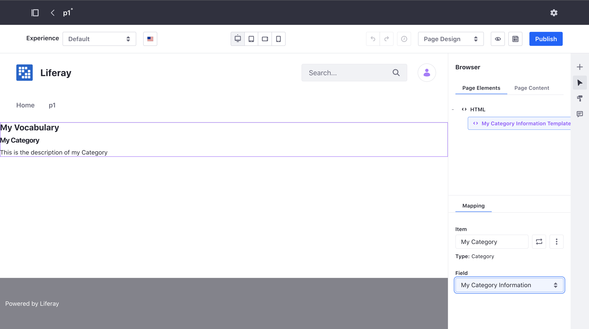

title: Information Templates
author:
  name: Lourdes Fernández, Rubén Pulido
style: basic-style.css
output: index.html
controls: false

Siguientes pasos:
- (Ruben) Pulir las slides
- (Ruben) Escribir el script de lo que vamos a decir
- (Lourdes) Crear el contenido / information templates
- Grabar capturas de video con las "demos"
- Pensar como nos distribuimos los tiempos
- Grabar los videos
- Timestamps
- (Ruben) Añadir cambios a proyecto de github

# Outline (0.5 min)
# What are Information Templates (2 min)
# What problem do Information Templates solve (2 min)
# What advantage do Information Templates offer (0.5 min)
# What entities support Information Templates Out of the Box (0.5 min)
# How to create a new Information Template -> Mostrar Administración (importar scripts) (2 min)
# How to apply an Information Template in the Page Editor -> Mostrar Page Editor (sitios donde los podemos aplicar) (3 min) -> Mostrar video en paralelo
# What advantage do Information Templates offer (revisit) (2 min)
# How can I make my custom entity support Information Templates (1 min)
# Summary (0.5 min)

--
# Exploit the power of templates for all types of content
--
### Information Templates
- Definition
- Purpose and advantages
- Supported entity types
- How to use them
- How to add support for a custom entity type

[//]: # (0.5 min)
[//]: # (Information Templates are an addition to Liferay 7.4, which makes possible to define the way entities of any type are displayed in a specific way)
[//]: # (We are going to cover what they are, which problem they solve, which entity types have support for them and how to use them. We'll finish describing how to make a custom entity support information templates)

--
### What are Information Templates
- **Freemarker** templates
- Allow **displaying any entity of a certain type** in a specific way
- An entity type can have **multiple** Information Templates
- Has access to same **fields** available for mapping on page editor

[//]: # (Information Templates are Freemarker templates which allow displaying any entity of a certain type in a specific way)
[//]: # (Multiple Information Templates can be created for an entity type or subtype. For example we can create different ways of visualizing a document, a category, or any other entity)
[//]: # (An information template has access to the entity being displayed. The same fields we are able to map through the page editor are available to be used on the information template)
[//]: # (There is an exception: Fields based on templates which are available for mapping on the page editor are not available within Information Templates to prevent infinite loops from happening)
[//]: # (Those of you familiar with web content templates and widget templates will find information templates very similar)

--
### Information Template for Category


[//]: # (This is an example of an Information Template displaying an entity of type Category)

--
### Information Template used on Page


[//]: # (And this is an example of a Page displaying a specific category by using the previously shown Information Template. We will show in more detail how to create and use Information Templates later on)

--
### What is their purpose
**Centralize** the way of **visualizing entities of a certain type** in a **reusable** and **easy to modify** manner

[//]: # (The purpose of having Information Templates is to provide a centralized way to visualize entitites of a certain type, so that it can be reused and easily modified)
[//]: # (Like a Display Page Template, an Information Template is associated  to a certain entity type)
[//]: # (A Display Page Template is used to display an entity on the whole page. An Information Template however is used to display an entity on a section of a page)

--
### Display Page Template vs Information Template

[comment]: <> (- Similar to Display Page Templates, but designed to be used within a part of a page &#40;e.g: an element in a collection&#41;, instead of the whole page.)

--
### Advantages of Information Templates
- **Ease of use**:  
  **Selecting a template** (instead of mapping multiple elements in a fragment to the fields of an entity)  
  → **minimizes errors**
- **Ease of change**:  
  Performing **changes only once** (in the Information Template instead of across pages)  
  → **saves time and effort**

[//]: # (Information Templates offer multiple advantages)
[//]: # (They are easy to use, allowing page creators to visualize an entity by just selecting a template, instead of using a fragment and mapping multiple elements to the fields of an entity. This way the likelikehood of making manual errors when visualizing an entity is minimized)
[//]: # (They also allow peforming changes in an  easy way. If for example the visualization of an entity needs to be enriched with additional fields, the change can be performed only once, in the Information Template, instead of having to update each page where a fragment has been used. This way changes can be performed faster and with less effort)

[//]: # (?? Currently, creating Information Templates requires Freemarker knowledge. In the future we hope to be able to ease the task of creating them by offering visual editing support)

[//]: # (?? Idea: Mostrar video acelerado de cuantos cambios hay que hacer cuando se usan fragmentos mapeando cada campo)

--
### Entities supporting Information Templates Out of the Box


[//]: # (Out of the box support for Information Templates is available for all the following types of entities: Web Content, Documents, Blogs, Categories, Objects and Assets)
[//]: # (Notice, that Assets support Information Templates although they don't support Display Page Templates)

--
### How to create an Information Template
[//]: # (Show administration view, import Information Templates)

[//]: # (Notice, that Assets support Information Templates although they don't support Display Page Templates)

[//]: # (TODO: Embed gif with video showing how to create an Information Template and import a file)

--
### How to apply an Information Template in the Page Editor
- **Mapping** it to a **text or rich text editable element of a fragment**
- Through **Content Display Fragment**
- Within a **Collection Display Fragment**
- Within a **Display Page Template**

[//]: # (TODO: Embed gif with video. Show page editor explaining where we can apply Information Templates. Should we split it into 3 slides with 1 video each?)

--
### What advantage do Information Templates offer (revisit) (2 min) 
[//]: # (TODO: Idea: Mostrar video haciendo lo mismo con plantilla)

[//]: # (Mencionar que resetear la caché es necesario en caso de que en los fragmentos en los que hayas usado el Information template sean cacheables)

--
###  How can I make my custom entity support Information Templates
1) Implement **InfoItemDetailsProvider**  
2) Implement **InfoItemCapabilitiesProvider**  
3) Add InfoFieldSet to InfoForm in **InfoItemFormProvider**  
4) Add InfoFieldValue to InfoItemFieldValues in **InfoItemFieldValuesProvider**

[//]: # (In order to add Information Templates support for our custom entity we need to follow 4 steps)

--
### 1) Implement InfoItemDetailsProvider
```java
@Component(immediate = true, service = InfoItemDetailsProvider.class)
public class MyEntityInfoItemDetailsProvider
	implements InfoItemDetailsProvider<MyEntity> {

	@Override
	public InfoItemClassDetails getInfoItemClassDetails() {
		return new InfoItemClassDetails(MyEntity.class.getName());
	}

	@Override
	public InfoItemDetails getInfoItemDetails(MyEntity player) {
		return new InfoItemDetails(
			getInfoItemClassDetails(),
			new InfoItemReference(MyEntity.class.getName(), myEntity.getId()));
	}
}
```

[//]: # (The first step is to create an implementation of InfoItemDetailsProvider for our custom entity if we have not done so already)

--
### 2) Implement InfoItemCapabilitiesProvider
```java
@Component(service = InfoItemCapabilitiesProvider.class)
public class MyEntityInfoItemCapabilitiesProvider
	implements InfoItemCapabilitiesProvider<Player> {

	@Override
	public List<InfoItemCapability> getInfoItemCapabilities() {
		return ListUtil.fromArray(_templatePageInfoItemCapability);
	}

	@Reference
	private TemplateInfoItemCapability _templatePageInfoItemCapability;
}
```

[//]: # (The second step is to create an implementation of InfoItemCapabilitiesProvider for our custom entity)

--
### 3) Add InfoFieldSet to InfoForm
```java
@Component(immediate = true, service = InfoItemFormProvider.class)
public class MyEntityInfoItemFormProvider
	implements InfoItemFormProvider<MyEntity> {

	@Override
	public InfoForm getInfoForm() {
		return InfoForm.builder(
		).infoFieldSetEntry(
			InfoFieldSet.builder(
			).infoFieldSetEntry(
				// ...
			).infoFieldSetEntry(
				_templateInfoItemFieldSetProvider.getInfoFieldSet(
					MyEntity.class.getName())
			).labelInfoLocalizedValue(
				InfoLocalizedValue.localize(
					MyEntityInfoFields.class, "myEntity")
			).build()
		).name(
			"MyEntity"
		).build();
	}

	@Reference
	private TemplateInfoItemFieldSetProvider _templateInfoItemFieldSetProvider;
}
```

[//]: # (The third step is to add an InfoFieldSet entry to the list of InfoFieldSets returned by the implementation of the InfoItemFormProvider for our custom entity. In order to obtain the InfoFieldSet for our entity we can use TemplateInfoItemFieldSetProvider class, which returns an InfoField for every Information Template created for our custom entity)

--
### 4) Add InfoFieldValue to InfoItemFieldValues
```java
@Component(immediate = true, service = InfoItemFieldValuesProvider.class)
public class MyEntityInfoItemFieldValuesProvider
	implements InfoItemFieldValuesProvider<MyEntity> {

	@Override
	public InfoItemFieldValues getInfoItemFieldValues(MyEntity myEntity) {
		List<InfoFieldValue<Object>> infoFieldValues = new ArrayList<>();
		// ...
		infoFieldValues.addAll(
			_templateInfoItemFieldSetProvider.getInfoFieldValues(
				MyEntity.class.getName(), myEntity));

		return InfoItemFieldValues.builder(
		).infoFieldValues(
			infoFieldValues
		).infoItemReference(
			new InfoItemReference(MyEntity.class.getName(), myEntity.getId())
		).build();
	}

	@Reference
	private TemplateInfoItemFieldSetProvider _templateInfoItemFieldSetProvider;
}
```

[//]: # (The fourth and final step is to add an InfoFieldValue entry to the list of InfoFieldValues returned by the implementation of the InfoItemFieldValuesProvider for our custom entity. In order to obtain the list of InfoFieldValues for our entity we can use TemplateInfoItemFieldSetProvider, which will return an InfoFieldValue for every Information Template created for our custom entity)

-- 
### Summary: Information Templates 
- Allow **displaying any entity of a certain type** in a specific way
- Offer a **centralized** way to visualize entities, so it can be **reused** and **easily modified**, reducing time and effort to apply changes
- Available **out of the box** for multiple entity types. Support can be added for **custom entities** 

[//]: # (To wrap up, let's take a look at what we have covered.)
[//]: # (Information Templates are a new addition to 7.4 which allow defining ways to display any entity of a certain type)
[//]: # (They have the advantage of offering a centralized way to visualize entities. They can be reused and easily modified, reducing the time and effort needed for applying changes)
[//]: # (They are available out of the box for multiple entity types and support for custom entities can be easily added)

--
### Thank you!

--
