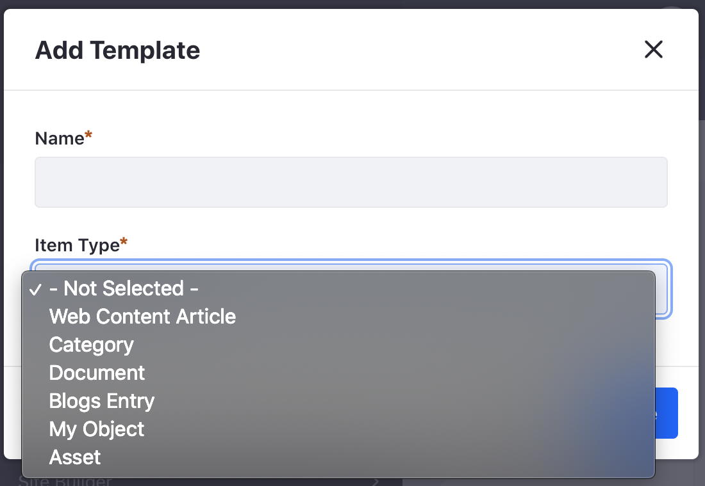
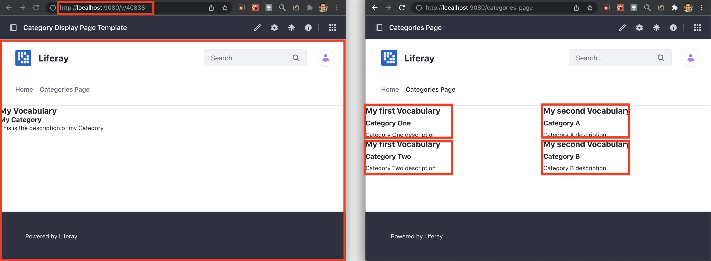
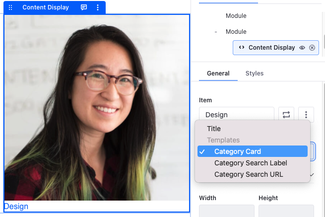
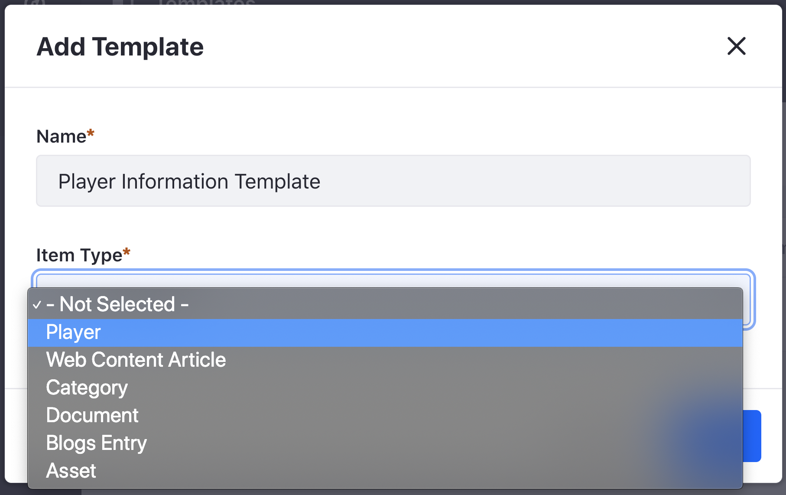
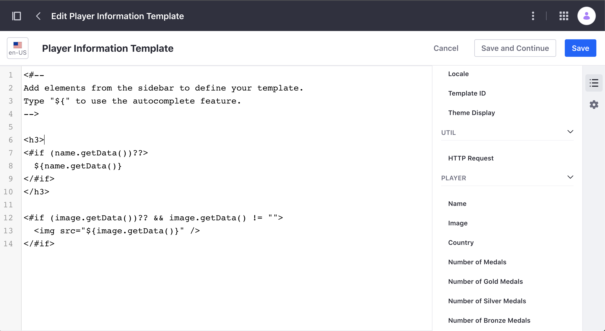

title: Information Templates
author:
  name: Lourdes Fernández Besada, Rubén Pulido de los Reyes
style: basic-style.css
output: index.html
controls: false

--
# Exploit the power of templates for all types of content
--
### Information Templates
- Definition and Purpose
- Comparison with Display Page Templates
- How to create and use them
- Advantages
- How to add support for a custom entity type

<!-- Speaker: L 1 (0.30,0:21) L +++ --> 
<!-- (Information Templates are an addition to Liferay 7.4, which makes possible to define the way entities  of any type are displayed in a specific way) -->
<!-- (We are going to cover what they are, which problem they solve, which entity types have support for  them and how to use them. We'll finish describing how to make a custom entity support information templates) -->

--
### What are Information Templates
- **Freemarker** templates
- Allow **displaying any entity of a certain type** in a specific way
- An entity type can have **multiple** Information Templates
- Same **fields** available as for mapping on page editor

<!-- 2 (1:00,1:03) -->

<!-- Speaker: R 2.1 L ++ -->
<!-- (Information Templates are Freemarker templates which allow displaying any entity of a certain type in  a specific way) --> 
<!-- (Multiple Information Templates can be created for an entity type or subtype. For example we can create  different ways of visualizing a document, a category, or any other entity) --> 

<!-- Speaker: R 2.2 L + -->
<!-- (An information template has access to the entity being displayed. The same fields we are able to map   through the page editor are available to be used on the information template) -->
<!-- (There is an exception: Fields based on templates which are available for mapping on the page editor   are not available within Information Templates to prevent infinite loops from happening) -->
<!-- (Those of you familiar with web content templates and widget templates will find information templates  very similar) -->

--
### Example: Information Template for Category


<!-- Speaker: L 3 (0:10,0:07) L+++ -->
<!-- (This is an example of an Information Template displaying an entity of type Category) -->

--
### Example: Information Template for Category used on Page


<!-- Speaker: L 4 (0:15,0:14) L+++-->
<!-- (And this is an example of a Page displaying a specific category by using the previously shown Information Template. We will show in more detail how to create and use Information Templates later on)

--
### What is their purpose
- Support **templating all entity types**  
  (including Objects and custom entity types)



- **Centralize** the way of **visualizing entities** in a **reusable** and **easy to modify** manner

<!-- Speaker: R 5 (0:30,0:29) L+++ -->
<!-- (The purpose of having Information Templates is to provide templating support for all entity types) -->
<!-- (This implies having a centralized way to visualize entities of a certain type, so that it can be  reused and easily modified. -->
<!-- (Before Information Templates, this could only be done for Web Content) -->

<!-- (Out of the box support for Information Templates is available for all the following types of entities: Web Content, Documents, Blogs, Categories, Objects and Assets) --> 

--
### Comparison: Display Page Templates
||Display Page Templates|Information Templates|
|:---------------------------------|:-:|:-:|
| **Supports Assets**              |❌|✅|


<!-- Speaker: L 6 (0:30,0:28) L+++ -->
<!-- (Before diving further into Information Templates we'd like to point out the differences between Display Page Templates and Information Templates, so we have a better understanding of the latter ones) --> 
<!-- (Like a Display Page Template, an Information Template is associated with a certain entity type) -->
<!-- (However, Assets don't have support for Display Page Templates, but they do have support for Information Templates) --> 

--
||Display Page Templates|Information Templates|
|:----------------------|:-:|:-:|
| **Editing Mode**      |Visual 👁️|Freemarker <#>| 


<!-- Speaker: L 7 (0:10,0:12) L+++ -->
<!-- (Display Page Templates can be edited visually through the Page Editor, whereas Information Templates are edited using the Freemarker editor, with autocomplete capabilities) --> 

--
||Display Page Templates|Information Templates|
|:--------------|:-:|:-:|
| **Page**<br>  |Whole|Portion| 
| **Dedicated URL**<br>  |✅|❌|



<!-- Speaker: R 8 (0:30,0:27) L+ used, associated -->
[//]: <> (A Display Page Template is used to display an entity on the whole page whereas an Information Template is used to display an entity on a section of a page, and multiple Information Templates can be used within the same page)
[//]: <> (As a consequence, when visualizing a specific entity through a Display Page Template a dedicated URL is available, whereas an entity displayed through an Information Template does not have any URL associated)

--
[comment]: <> (TIEMPO TOTAL DEL VIDEO: 1:00 )
### Create Information Templates


[comment]: <> (<video controls autoplay muted preload width="800">)
[comment]: <> (    <source src="./videos/page-with-templates.gif" type="video/mp4">)
[comment]: <> (</video>)

[comment]: <> (VIDEO: Go to templates admin and create blogs entry card)
<!-- Speaker: L 9 (0:25,0:24) L+++ -->
<!-- (We are now going to show how to create Information Templates) -->
<!-- (From the administration view, under Design, we select Templates) -->
<!-- (All available Information Templates are listed. We can create a new one and select the Item Type. In this case Blogs Entry) -->
<!-- (We can quickly create a template by importing an existing file with the Freemarker Code, as we do here  for our Blog Entry Card template) -->

[comment]: <> (VIDEO: Create category card template)
<!-- Speaker: R 10 (0:12,0:12) L++ select -->
<!-- (We are now going to create a second template, Category Card. We select Category as type. If we had an entity with subtype we would also select the item subtype, as for example in Documents) -->

[comment]: <> (VIDEO: Create Search label template)
<!-- Speaker: R 11 (0:13,0:13) L++ directly -->
<!-- (We can also create an information template by typing directly the Freemarker code into the editor and benefiting from the autocompletion capabilities, as we do here for our Category Search Label template) -->

[comment]: <> (VIDEO: Create Category Search URL template)
<!-- Speaker: L 12 (0:10,0:09) L+++ -->
<!-- (Finally, we can also create a template by copying an existing one and modifying it, as shown here for our Category Search URL template) -->

--
### Use Information Templates
- Within a **Content Display Fragment**, selecting the template

- Within any fragment **mapping** a **text or rich text editable element** to the template


<!-- Speaker: R 13 (0:25,0:26) L+++ available -->
[comment]: <> (Information Templates can be used in any type of Page or Page Template created on the Page Editor)
[comment]: <> (There are two ways to use them:)
[comment]: <> (Within a Content Display Fragment, all available templates are listed and we can select the one we want to apply)
[comment]: <> (Or within any other Fragment, mapping an editable element of type text or rich text to any of the available templates)
[comment]: <> (Let's see an example)

--
[comment]: <> (TIEMPO TOTAL DEL VIDEO: 1:33 )
### Use Information Templates


<!-- Speaker: L 14 (0:15,0:14) L+++ -->
[comment]: <> (VIDEO: Show content: Categories, Blogs and Collections)
[comment]: <> (Our goal is to have a page where we display 3 categories on the left, and a collection of blog entries on the right, along with a link to obtain more information about the categories assigned to each of the blog entries)

<!-- Speaker: R 15 (0:21,0:21) L++ "for" instead of "of" -->
[comment]: <> (VIDEO: Show page structure)
[comment]: <> (We have prepared the skeleton of the page we want to create. It contains a grid with two modules. On the left module we have a grid with a Content Display fragment for each of the 3 categories we want to display. On the right module we have a Collection Display where we are going to display our Blog Entries along with their associated categories)

<!-- Speaker: R 16 (0:08,0:08) L+++ -->
[comment]: <> (VIDEO: Map Content Displays to Category Cards)
[comment]: <> (On the left, we now map each of the Content Displays to a Category, displaying it with the Category Card Information Template)

<!-- Speaker: R 17 (0:09,0:09) L++ show, configured -->
[comment]: <> (VIDEO: Show Collection Display configuration and show that HTML fragment has been added Collection Display Item)
[comment]: <> (On the right, our Collection Display is configured to show the Collection of Blog Entries using an HTML fragment for each of them)

<!-- Speaker: L 18 (0:05,0:05) L+++ -->
[comment]: <> (VIDEO: Show mapping of HTML to Blog Entry Card)
[comment]: <> (We map the HTML fragment to the Blog Entry Card Information Template)

<!-- Speaker: L 19 (0:10,0:09) L+++ -->
[comment]: <> (VIDEO: Show nested Collection Display, configured to Categories of this Item)
[comment]: <> (For each Blog Entry we have added a nested Collection Display and configured it to show the Related Collection Provider named Categories for this Item)

<!-- Speaker: L 20 (0:05,0:05) L+++ -->
[comment]: <> (VIDEO: Show that Button has been added to nested Collection Display Item)
[comment]: <> (To display the related categories we have added a Button Fragment)

<!-- Speaker: L 21 (0:10,0:09) L+++ -->
[comment]: <> (VIDEO: Show mapping of button label and URL)
[comment]: <> (We configure the button with its label mapped to the Category Search Label template, and its Link mapped to the Category Search URL template)

<!-- Speaker: L 22 (0:10,0:10) L+++ -->
[comment]: <> (VIDEO: We now publish)
[comment]: <> (As you can see we have configured an elaborated page very easily and quickly by using Information Templates to display all entities that are shown on the page)

--
### Recap: Use of Information Templates
- To display **entities of different types**
- **Multiple** for **one entity type**
- Used in **Content Display** and **text or rich text editable elements** of any fragment

<!-- Speaker: R 23 (0:17,0:17) L+++ -->
[comment]: <> (A quick recap:)
[comment]: <> (We have used Information Templates to display Blog Entries and Categories)
[comment]: <> (For Categories, we have used 3 different Information Templates)
[comment]: <> (We have used Information Templates in the Content Display, HTML and Button fragments)

--
###  Advantages of Information Templates
- 🔧 **Ease of use**:  
  **Selecting a template** (instead of mapping multiple elements in a fragment to the fields of an entity)  
  → **minimizes errors**
- 🖌️️ **Ease of change**:  
  Performing **changes only once** (in the Information Template instead of across all pages)  
  → **saves time and effort**

<!-- Speaker: L 24 (0:49,0:49) -->
<!-- 24.1 L+++ -->
<!-- (Information Templates offer multiple advantages) -->
<!-- (We have just seen that are really easy to use. They allow page creators to visualize an entity by just selecting a template, instead of using a fragment and mapping multiple elements to the fields of an entity. Fewer manual steps imply a lower chance of making mistakes) -->
<!-- Speaker: R 24.2 L+ changes, my fault, I changed a bit the sentence "needs to be modified" so it's correct -->
<!-- (They also allow performing changes in an easy way. If the visualization of an entity needs to be enriched with additional fields or an existing one needs to be modified, the change can be performed only once, in the Information Template, instead of having to update each page where a fragment has been used. This way changes can be performed faster and with less effort) -->
<!-- Let's see an example and compare both ways -->

-- 

[comment]: <> (TIEMPO TOTAL DEL VIDEO: 1:43 )
### Advantages of Information Templates


[comment]: <> (VIDEO SECTION: Page preparation)

<!-- Speaker: R 25 (0:19,0:18) L++ called -->
[comment]: <> (VIDEO:  Enseñar fragmento y composicion que voy a poner e ir a edicion de pagina)
[comment]: <> (In order to showcase the difference, we are going to replicate the left section of the page on the right side, but this time using fragments instead of Information Templates.)
[comment]: <> (We have created a fragment called Category Card that mimics the view of the Category Card Information Template.)

<!-- Speaker: R 26 (0:11,0:10) -->
<!-- 26.1 L++ instances, editable -->
[comment]: <> (VIDEO: En la pagina, cambiar el grid para añadir un módulo, redimensionar el grid y añadir la composición y mostrarla rapido)
[comment]: <> (We have added to the page a fragment composition containing 3 instances of the Category Card fragment with all editable elements mapped to the different Category fields.)
<!-- Speaker: R26.2 L++ equivalent -->
[comment]: <> (ADD: Dragging the fragment 3 times would be equivalent to dragging the fragment composition)

<!-- Speaker: R 27 (0:14,0:14) L+++ -->
[comment]: <> (VIDEO: Publicar la pagina y ver que se ve igual)
[comment]: <> (When we publish the page we see that the two sidebars behave exactly the same, despite the different implementation)
[comment]: <> (Our business requirement now is to link the name of the Category to its Display Page.)

[comment]: <> (VIDEO SECTION: Cambiar el fragmento)

<!-- Speaker: R 28 (0:21,0:20) L++ page, configured -->
[comment]: <> (VIDEO: Modificar el fragmento para añadir el enlace. Ir a la pagina en visualización y verificar que link añadido no funciona.)
[comment]: <> (In order to do that with the fragment based solution, we need to modify the fragment adding an editable element of type link. Since Fragment Propagation is enabled, as soon we publish the fragment, the change is visible on all pages where the fragment is used, but the link needs to be configured in order to work)

<!-- 29 (0:20,0:20) -->
<!-- Speaker: R 29.1 L+++ -->
[comment]: <> (VIDEO: Mapeo cada uno de los fragmentos al nuevo campo &#40;tedioso!&#41;)
[comment]: <> (We need to map each of the fields of the link on every instance of the fragment. Notice how this can be tedious and error prone if we have many instances of the fragment, which may be on other pages as well)
<!-- Speaker: L 29.2 L+++++++++++++++++++++++ -->
[comment]: <> (ADD: Ruben/Lourdes, Don't you feel you are getting older while these mappings are manually performed?)
<!-- Speaker: R 29.3 L+++ -->
[comment]: <> (ADD: Absolutely!)
<!-- Speaker: R 29.4 L+++ -->
[comment]: <> (Once we publish the page, the link now works as expected, taking us to the Display Page of each category when clicking on it)

[comment]: <> (VIDEO SECTION: Crear template)
[comment]: <> (VIDEO: Crear template)
<!-- Speaker: L 30 (0:18,0:18) L+++ -->
[comment]: <> (With the Information Template based solution, we only need to edit the template adding the link and saving it)
[comment]: <> (Editing the page is not required in this case. The page works without any additional action. )
[comment]: <> (Making the change is easy, fast and failsafe.)

--
###  How can I make my custom entity support Information Templates
1) Implement **InfoItemDetailsProvider**  
2) Add InfoFieldSet to InfoForm in **InfoItemFormProvider**  
3) Add InfoFieldValue to InfoItemFieldValues in **InfoItemFieldValuesProvider**  
4) Implement **InfoItemCapabilitiesProvider**

https://github.com/ruben-pulido/player/pull/1

[comment]: <> (TODO: Add link to github code)

<!-- Speaker: L 31 (0:11,0:11) L+++ -->
[comment]: <> (So far we have seen how to create and use Information Templates for out of the box entities.)
[comment]: <> (Support for custom entities can be added by following these 4 steps)

--
### 1) Implement InfoItemDetailsProvider
```java
@Component(immediate = true, service = InfoItemDetailsProvider.class)
public class MyEntityInfoItemDetailsProvider
	implements InfoItemDetailsProvider<MyEntity> {

	@Override
	public InfoItemClassDetails getInfoItemClassDetails() {
		return new InfoItemClassDetails(MyEntity.class.getName());
	}

	@Override
	public InfoItemDetails getInfoItemDetails(MyEntity myEntity) {
		return new InfoItemDetails(
			getInfoItemClassDetails(),
			new InfoItemReference(MyEntity.class.getName(), myEntity.getId()));
	}
}
```
<!-- Speaker: L (0:12,0:12) L+++ -->
<!-- 32 (The first step is to create an implementation of InfoItemDetailsProvider for our custom entity if we have not done it already for adding support for Display Page Templates) --> 

[comment]: <> (FAST EXPLANATION)
[comment]: <> (Implement InfoItemDetailsProvider)

--
### 2) Add InfoFieldSet to InfoForm
```java
@Component(immediate = true, service = InfoItemFormProvider.class)
public class MyEntityInfoItemFormProvider
	implements InfoItemFormProvider<MyEntity> {

	@Override
	public InfoForm getInfoForm() {
		return InfoForm.builder(
		).infoFieldSetEntry(
			InfoFieldSet.builder(
			).infoFieldSetEntry(
				// ... other fields available for mapping and templates
			).infoFieldSetEntry(
				_templateInfoItemFieldSetProvider.getInfoFieldSet(
					MyEntity.class.getName())
			).labelInfoLocalizedValue(
				InfoLocalizedValue.localize(
					MyEntityInfoFields.class, "myEntity")
			).build()
		).name(
			"MyEntity"
		).build();
	}

	@Reference
	private TemplateInfoItemFieldSetProvider _templateInfoItemFieldSetProvider;
}
```

<!-- Speaker: L 33 (0:22,0:22)  L+++ custom -->
<!-- (The second step is to add an InfoFieldSet entry to the list of InfoFieldSets returned by the implementation of the InfoItemFormProvider for our custom entity. In order to obtain the InfoFieldSet for our entity we use TemplateInfoItemFieldSetProvider, which returns an InfoField for every Information Template of our custom entity) --> 

[comment]: <> (FAST EXPLANATION)
[comment]: <> (Add InfoFieldSet to InfoForm in InfoItemFormProvider)

--
### 3) Add InfoFieldValue to InfoItemFieldValues
```java
@Component(immediate = true, service = InfoItemFieldValuesProvider.class)
public class MyEntityInfoItemFieldValuesProvider
	implements InfoItemFieldValuesProvider<MyEntity> {

	@Override
	public InfoItemFieldValues getInfoItemFieldValues(MyEntity myEntity) {
		List<InfoFieldValue<Object>> infoFieldValues = new ArrayList<>();
		// ...
		infoFieldValues.addAll(
			_templateInfoItemFieldSetProvider.getInfoFieldValues(
				MyEntity.class.getName(), myEntity));

		return InfoItemFieldValues.builder(
		).infoFieldValues(
			infoFieldValues
		).infoItemReference(
			new InfoItemReference(MyEntity.class.getName(), myEntity.getId())
		).build();
	}

	@Reference
	private TemplateInfoItemFieldSetProvider _templateInfoItemFieldSetProvider;
}
```

<!-- Speaker: R 34 (0:24,0:24) L+++ created -->
<!-- (The third step is to add an InfoFieldValue entry to the list of InfoFieldValues returned by the implementation of the InfoItemFieldValuesProvider for our custom entity. In order to obtain the list of InfoFieldValues for our entity we can use TemplateInfoItemFieldSetProvider, which will return an InfoFieldValue for every Information Template created for our custom entity) --> 

[comment]: <> (FAST EXPLANATION)
[comment]: <> (Add InfoFieldValue to InfoItemFieldValues in InfoItemFieldValuesProvider)

--
### 4) Implement InfoItemCapabilitiesProvider
```java
@Component(service = InfoItemCapabilitiesProvider.class)
public class MyEntityInfoItemCapabilitiesProvider
	implements InfoItemCapabilitiesProvider<MyEntity> {

	@Override
	public List<InfoItemCapability> getInfoItemCapabilities() {
		return ListUtil.fromArray(_templatePageInfoItemCapability);
	}

	@Reference
	private TemplateInfoItemCapability _templatePageInfoItemCapability;
}
```

<!-- Speaker: R 35 (0:08,0:08) -->
<!-- (The fourth and final step is to create an implementation of InfoItemCapabilitiesProvider for our custom entity) --> 

[comment]: <> (FAST EXPLANATION)
[comment]: <> (Implement InfoItemCapabilitiesProvider)

--
### Information Template for Custom Entity


<!-- Speaker: L 36 (0:07,0:07) L+++ -->
[comment]: <> (Once these 4 steps have been followed, our custom entity is selectable when creating a new Information Template)

--
### Information Template for Custom Entity


<!-- Speaker: R 37 (0:07,0:07) L fields, available -->
[comment]: <> (When editing the Information Template the fields of our custom entity are available to be used)

--
### Information Template for Custom Entity


<!-- Speaker: L 38 (0:07,0:07) -->
[comment]: <> (And the Information Templates created for our custom entity can be applied in the Page Editor)

-- 
### Summary: Information Templates 
- Allow **displaying any entity of a certain type** in a specific way
- Offer a **centralized** way to visualize entities, so it can be **reused** and **easily modified**, reducing time and effort to apply changes
- Available **out of the box** for multiple entity types. Support can be added for **custom entities** 

<!-- Speaker: R 39 (0:30,0:29) -->
<!-- (To wrap up) -->
<!-- (Information Templates are a new addition to 7.4 which allow defining ways to display any entity of a certain type) --> 
<!-- (They have the advantage of offering a centralized way to visualize entities. They can be reused and easily modified, reducing the time and effort needed for applying changes) --> 
<!-- (They are available out of the box for multiple entity types and support for custom entities can be added) --> 

--
### Thank you!
<!-- Speaker: R 40 (0:01,0:01) -->


<!-- Speaker: L 40.1 -->
[comment]: <> (We hope that you now have a good understanding of Information Templates)
<!-- Speaker: R 40.2 -->
[comment]: <> (And that you can soon benefit from using them. Enjoy!)
<!-- 40.3 -->
[comment]: <> (Enjoy!)
--
### Slides
https://ruben-pulido.github.io/information-templates/index.html